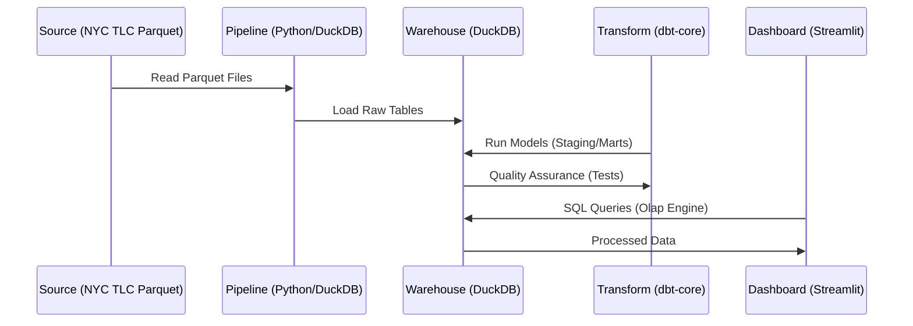
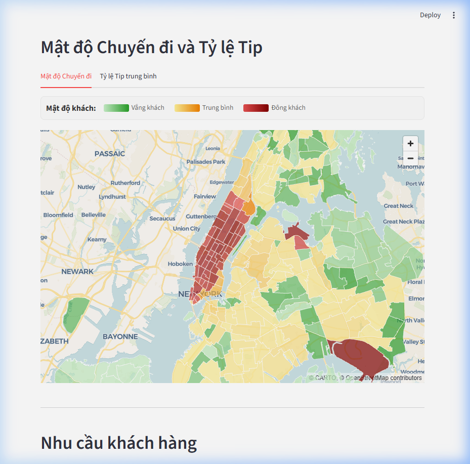

# 🚖 NYC Taxi Data Pipeline & BI Dashboard

## Project Overview
This project implements a complete end-to-end Data Engineering pipeline and Business Intelligence dashboard for the New York City Taxi & Limousine Commission (TLC) dataset. It processes millions of trip records to provide actionable insights into urban mobility, revenue trends, and customer behavior.

## 🏗️ Architecture & ETL Process
The pipeline follows a modern **ELT (Extract, Load, Transform)** architecture. Below is the conceptual flow of data from raw records to actionable insights:



## 📊 Dashboard Preview



## 🏗️ Technical Details
- **Storage/Compute:** [DuckDB](https://duckdb.org/) serves as the lightning-fast OLAP engine.

- **Transformation:** [dbt (data build tool)](https://www.getdbt.com/) handles data modeling and quality control.
- **Visualization:** [Streamlit](https://streamlit.io/) provides an interactive, real-time BI dashboard.
- **Maps:** [PyDeck](https://deckgl.github.io/pydeck/) with GeoJSON for high-performance spatial visualizations.

## 🚀 Getting Started

### Prerequisites
- Python 3.9+
- PowerShell (for running automation scripts)

### Installation
1. Clone the repository:
   ```bash
   git clone https://github.com/minhkhoi1907/nyc-taxi-data-pipeline.git
   cd nyc-taxi-data-pipeline
   ```
2. Install dependencies:
   ```bash
   pip install -r requirements.txt
   ```

### Running the Pipeline
- **Initial Batch Load:**
  ```powershell
  ./run_batch.ps1
  ```
- **Incremental Update:**
  ```powershell
  ./run_update.ps1
  ```

### Launching the Dashboard
```bash
streamlit run app/Home.py
```

## 📊 Dashboard Features
- **Executive Overview:** Real-time KPIs for Revenue, Total Trips, and Efficiency.
- **Spatial Analysis:** Pick-up density heatmaps and tip distribution by borough/zone.
- **Customer Behavior:** Analysis of passenger groups and airport-bound trip trends.
- **Strategic Insights:** Identification of "Golden Hours" for revenue and vendor market share.

## 🛠️ Tech Stack
- **Language:** Python
- **Database:** DuckDB
- **Modeling:** dbt-core
- **UI/UX:** Streamlit, Altair, PyDeck
- **Data Format:** Apache Parquet
