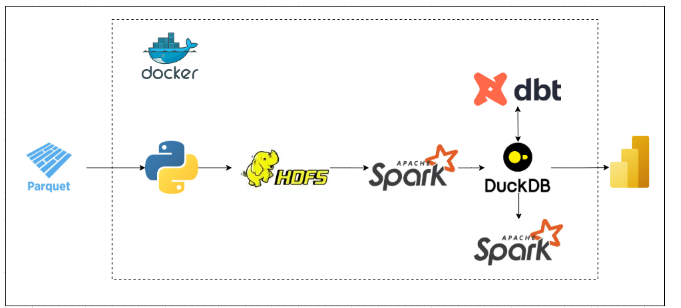
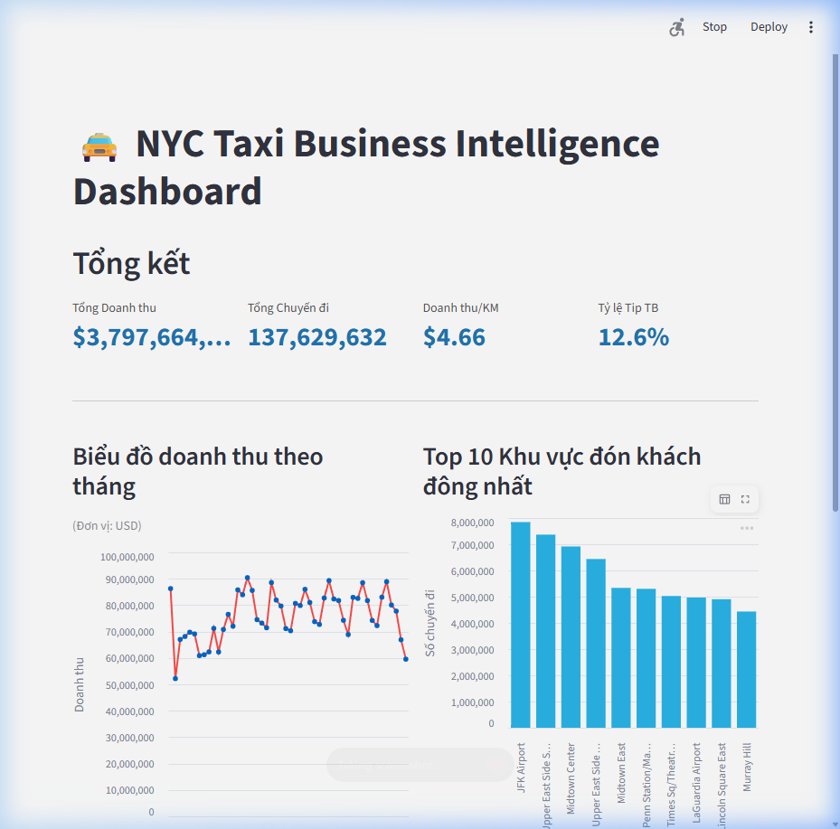
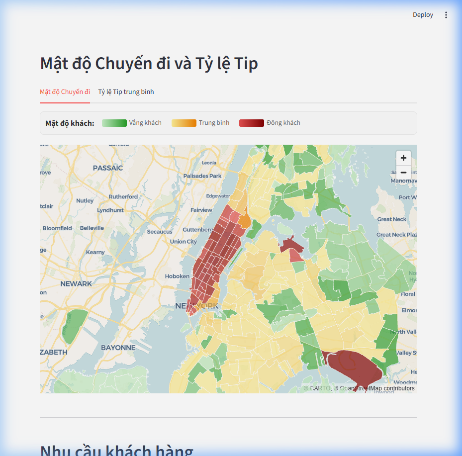
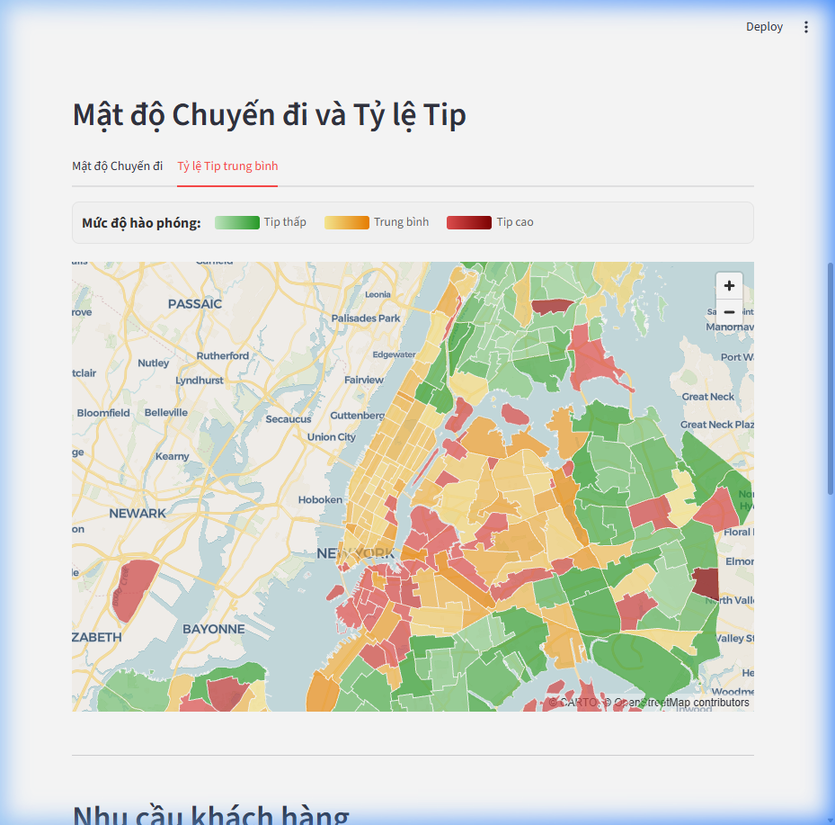
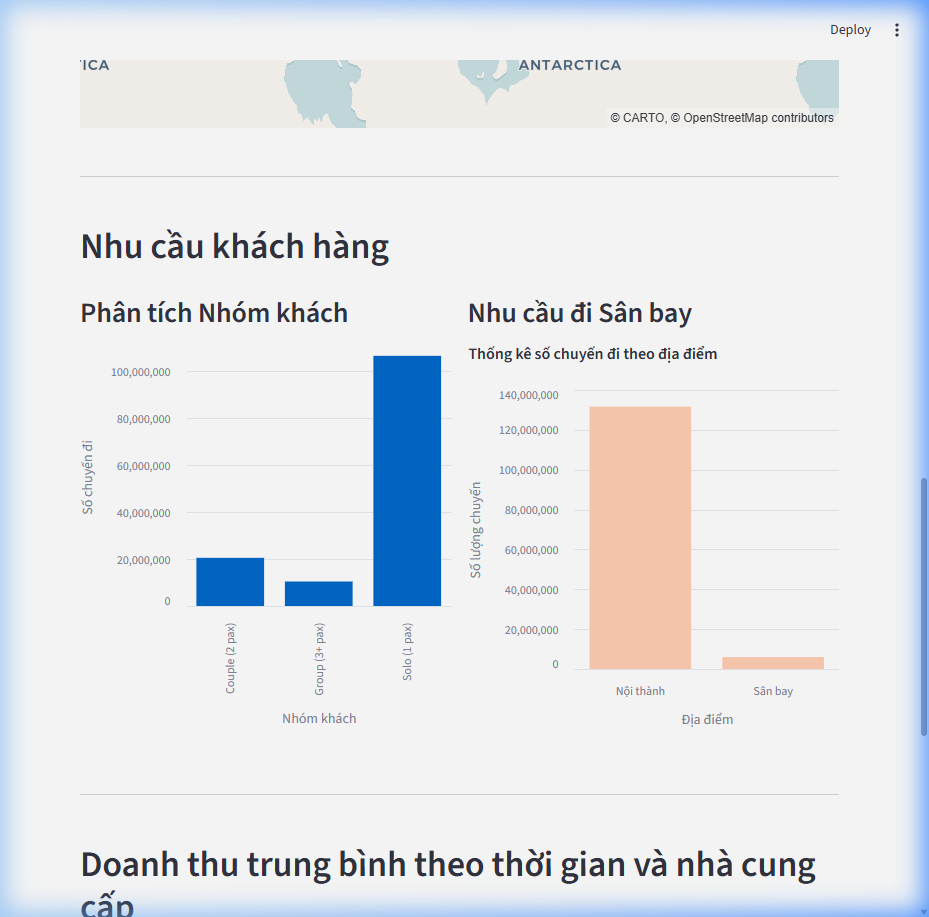
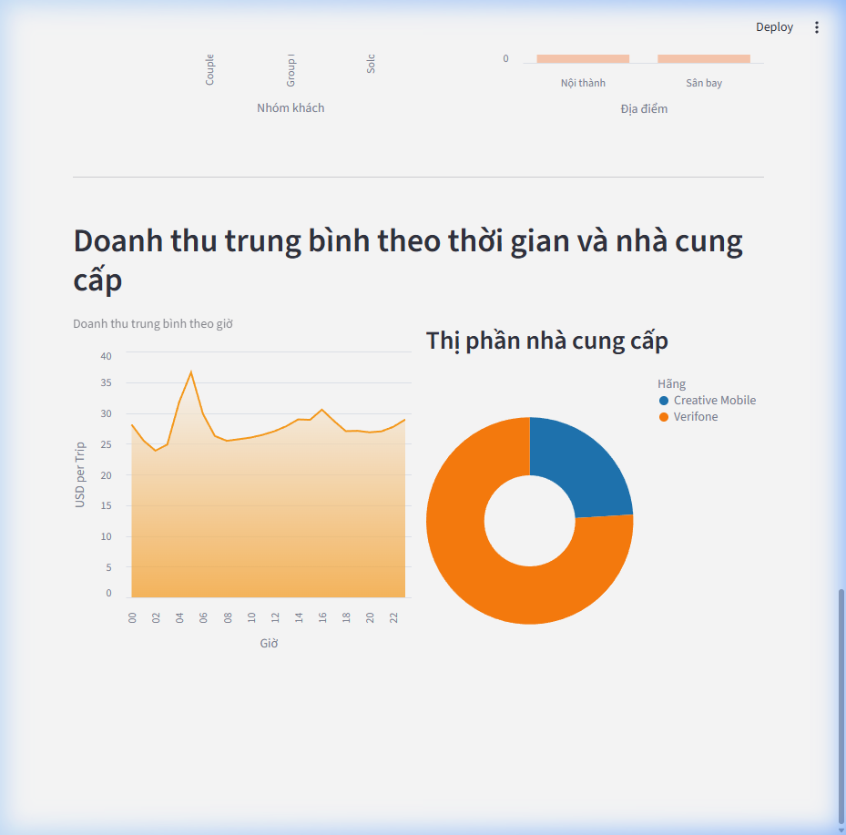

# 🚖 NYC Taxi Data Pipeline & BI Dashboard

## Project Overview
This project implements a complete end-to-end Data Engineering pipeline and Business Intelligence dashboard for the New York City Taxi & Limousine Commission (TLC) dataset. It processes millions of trip records to provide actionable insights into urban mobility, revenue trends, and customer behavior.

## 🏗️ Architecture & ETL Process
The pipeline follows a modern **ELT (Extract, Load, Transform)** architecture. Below is the conceptual flow of data from raw records to actionable insights:



## 📁 Project Structure
```plaintext
├── app/                  # Streamlit BI Dashboard & GeoJSON assets
├── assets/               # Project visuals & architecture diagrams
├── data/                 # Local data storage & DuckDB database
├── nyc_taxi_dbt/         # dbt project (Models, Macros, Tests)
│   ├── models/staging/   # Data cleaning & standardization
│   └── models/marts/     # Business-ready aggregated tables
├── scripts/              # Python & PowerShell automation scripts
├── docker-compose.yml    # Infrastructure (HDFS, Spark, etc.)
├── README.md             # Project documentation
└── requirements.txt      # Python dependencies
```

## 📊 Dashboard Preview
The interactive BI dashboard provides a 360-degree view of the taxi operations:

### 1. Executive Overview & Trends


### 2. Spatial Analysis (Trip Density & Tips)
Combine high-performance mapping with business metrics:



### 3. Customer Behavior & Strategic Insights



## 🧮 Data Modeling Layers
- **Staging Layer:** Standardizes schema and cleanses raw Parquet data (e.g., filtering out invalid coordinates or zero-passenger trips).
- **Mart Layer:** Creates multi-dimensional tables optimized for visualization (Revenue Analysis, Trip Demand, Customer Segments).

## 🚰 Data Source
- **Official Data:** [NYC TLC Trip Record Data](https://www.nyc.gov/site/tlc/about/tlc-trip-record-data.page)
- **Ingestion:** Automated via `scripts/extract_data.py`. The script fetches Parquet files from CloudFront and can optionally upload them to HDFS for distributed processing.

## 🔮 Future Roadmap (To-Do)
- [ ] **Advanced Orchestration:** Implement Apache Airflow or Prefect to replace PowerShell scripting.
- [ ] **Full Containerization:** Dockerize the entire stack (Dashboard + Pipeline) for easy deployment.
- [ ] **Cloud Migration:** Move data storage to AWS S3 and computation to Snowflake/GCP BigQuery.
- [ ] **CI/CD:** Integrate GitHub Actions for automated dbt testing and dashboard deployment.

## 🏗️ Technical Details
- **Storage/Compute:** [DuckDB](https://duckdb.org/) serves as the lightning-fast OLAP engine.

- **Transformation:** [dbt (data build tool)](https://www.getdbt.com/) handles data modeling and quality control.
- **Visualization:** [Streamlit](https://streamlit.io/) provides an interactive, real-time BI dashboard.
- **Maps:** [PyDeck](https://deckgl.github.io/pydeck/) with GeoJSON for high-performance spatial visualizations.

## 🚀 Getting Started

### 📋 Prerequisites
To run the Data Engineering pipeline (especially HDFS and Spark), you need to have the following installed on your machine:

1.  **Python 3.9 - 3.11:** (Avoid 3.12+ for now as some dbt-duckdb or PySpark libraries might have compatibility issues).
2.  **Java JDK 11 or 17:** (Required for PySpark). Make sure to set your `JAVA_HOME` environment variable.
3.  **Docker Desktop:** (Required to run the `namenode` and `spark-master` containers).
4.  **PowerShell:** (For running the automation scripts).

### 🛠️ Installation
1.  Clone the repository:
    ```bash
    git clone https://github.com/minhkhoi1907/nyc-taxi-data-pipeline.git
    cd nyc-taxi-data-pipeline
    ```
2.  Install Python dependencies:
    ```bash
    pip install -r requirements.txt
    ```

> [!TIP]
> If you get errors installing `pyspark` on Windows, ensure your Java (JDK 11/17) is installed and your `JAVA_HOME` environment variable is pointing to the JDK folder.

3.  (Optional) Start the infrastructure:
    ```bash
    docker-compose up -d
    ```

### Running the Pipeline
- **Initial Batch Load:**
  ```powershell
  ./run_batch.ps1
  ```
- **Incremental Update:**
  ```powershell
  ./run_update.ps1
  ```

### Launching the Dashboard
```bash
streamlit run app/Home.py
```

## 📊 Dashboard Features
- **Executive Overview:** Real-time KPIs for Revenue, Total Trips, and Efficiency.
- **Spatial Analysis:** Pick-up density heatmaps and tip distribution by borough/zone.
- **Customer Behavior:** Analysis of passenger groups and airport-bound trip trends.
- **Strategic Insights:** Identification of "Golden Hours" for revenue and vendor market share.

## 🛠️ Tech Stack
- **Language:** Python
- **Database:** DuckDB
- **Modeling:** dbt-core
- **UI/UX:** Streamlit, Altair, PyDeck
- **Data Format:** Apache Parquet
