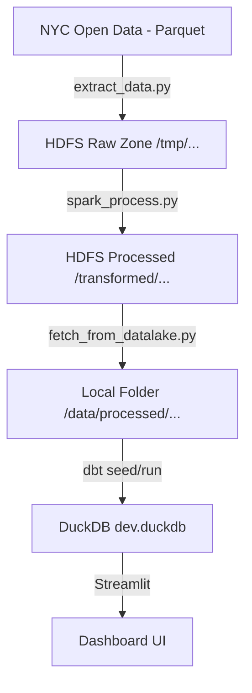

# Tài liệu Giám sát & Kiểm tra Dự án (Project Monitoring)

File này giúp bạn hiểu rõ luồng dữ liệu của dự án và cách tìm ra "điểm gãy" khi dữ liệu trên Dashboard hiển thị sai.

## 1. Sơ đồ Luồng dữ liệu (Data Lineage)

Dữ liệu đi qua các lớp sau, bạn có thể kiểm tra tại từng điểm này:



## 2. Cách theo dõi Dự án có gì? (Project Inventory)

| Thành phần | Vị trí / Công cụ kiểm tra | Mục đích |
| :--- | :--- | :--- |
| **HDFS (Hadoop)** | [http://localhost:9870](http://localhost:9870) | Xem dữ liệu thô đã tải về chưa. |
| **Spark Master** | [http://localhost:8080](http://localhost:8080) | Theo dõi các job xử lý dữ liệu có chạy thành công không. |
| **Local Data** | Thư mục `data/processed/` | Nơi lưu các file parquet sau khi Spark đã làm sạch. |
| **Logs** | Thư mục `logs/` | Xem chi tiết lỗi của từng script Python. |
| **Database** | File `dev.duckdb` | Dùng DBeaver hoặc CLI để truy vấn trực tiếp vào DuckDB. |
| **Dashboard** | Thư mục `app/` | Chứa code hiển thị (Streamlit). |

## 3. Kiểm tra dữ liệu sai ở đâu? (Troubleshooting)

Khi Dashboard (Streamlit) hiển thị con số bất thường, hãy kiểm tra theo thứ tự ngược:

### Bước 1: Kiểm tra lớp Mart (dbt)
Chạy lệnh test của dbt để xem logic transform có còn đúng không:
```powershell
cd nyc_taxi_dbt
dbt test
```
> [!TIP]
> Nếu `dbt test` thất bại, lỗi nằm ở logic transform trong file `.sql`. Kiểm tra các file trong `models/marts/`.

### Bước 2: Kiểm tra lớp Database (DuckDB)
Truy vấn trực tiếp để xem dữ liệu dbt đã load vào chưa:
- Mở file `dev.duckdb` bằng một công cụ SQL (như DBeaver hoặc DuckDB CLI).
- Chạy: `SELECT count(*) FROM fact_trip;`
- So sánh số lượng dòng với file parquet ở bước trước.

### Bước 3: Kiểm tra lớp Local Processed
Kiểm tra xem các file `.parquet` trong `data/processed/` có bị trống (0 KB) không. 
Nếu trống -> Lỗi ở `fetch_from_datalake.py` hoặc `spark_process.py`.

### Bước 4: Kiểm tra lớp HDFS & Spark
Nếu dữ liệu không về máy cục bộ:
1. Vào Spark UI (8080) xem Job có bị "Failed" không.
2. Kiểm tra log Spark bên trong container:
   `docker logs spark-master`

## 4. Các lỗi thường gặp (Common Issues)

- **Lỗi 403 Forbidden (Download)**: Do link tải dữ liệu từ NYC Open Data thay đổi hoặc hết hạn. Kiểm tra `extract_data.py`.
- **Lỗi Out of Memory (Spark)**: Do dữ liệu quá lớn cho container. Hãy thử chạy từng tháng thay vì chạy cả năm.
- **Lỗi Schema Mismatch (dbt)**: Do file parquet mới có thêm cột hoặc đổi tên cột. Cần cập nhật file `.sql` trong dbt.

---
*Tài liệu này nên được cập nhật mỗi khi bạn thêm một Model dbt mới hoặc thay đổi logic xử lý Spark.*
